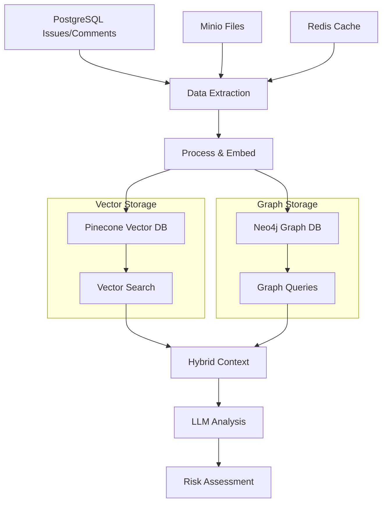
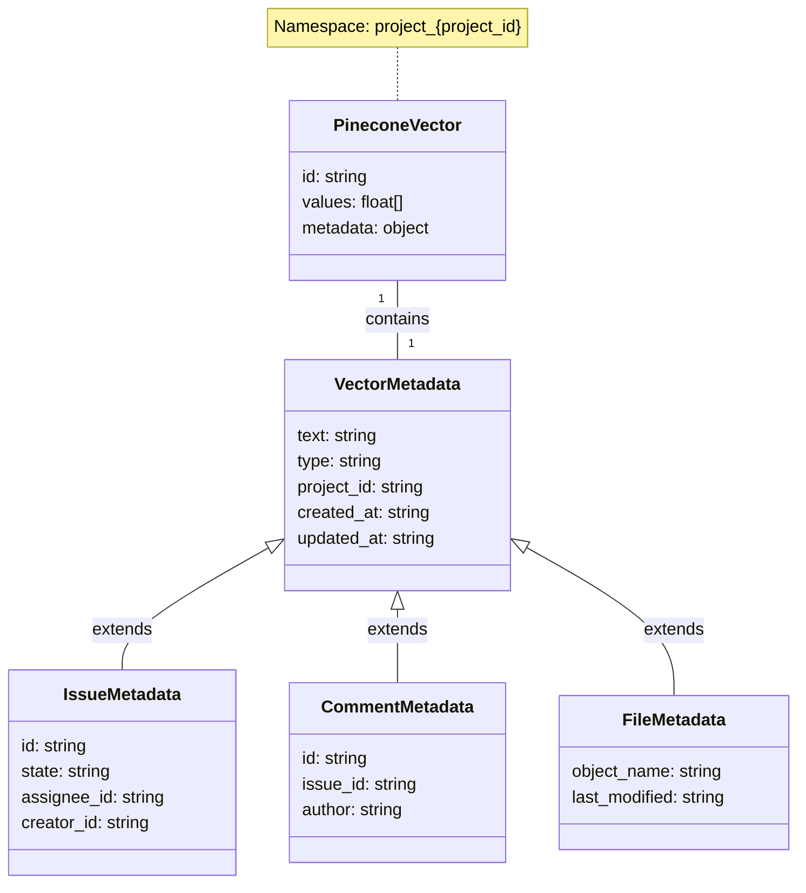
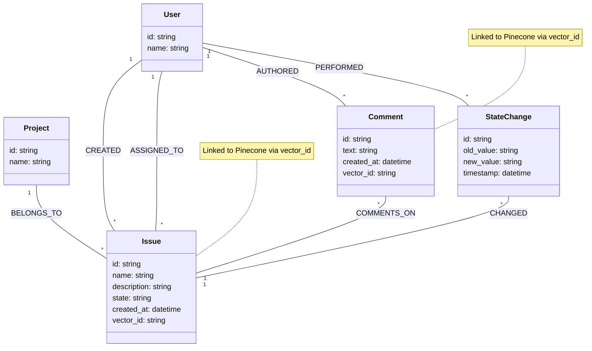
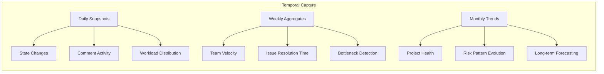
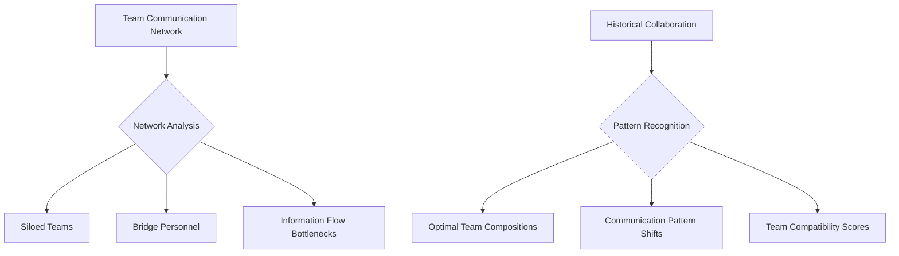
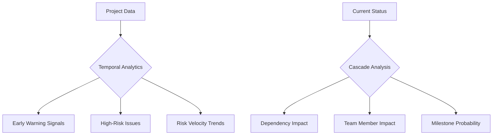
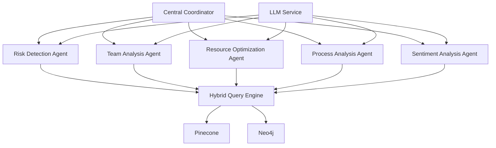
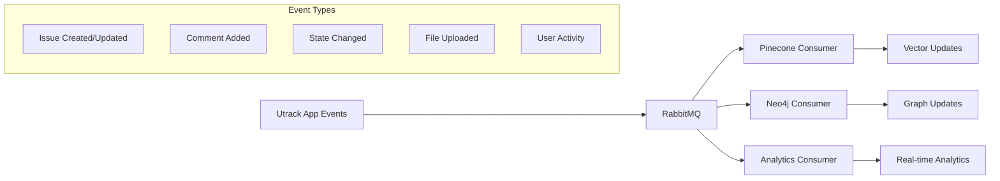

# Utrack Project Risk Analysis: RAG Implementation with Pinecone and Neo4j

## Hybrid Architecture Overview

This implementation uses a hybrid architecture combining:

1. **Pinecone** for vector embeddings and semantic search
2. **Neo4j** for graph relationships and pattern analysis

```
┌───────────────────┐      ┌─────────────────┐      ┌───────────────────┐
│   Data Sources    │      │  Processing     │      │  Storage Layer    │
├───────────────────┤      ├─────────────────┤      ├───────────────────┤
│ - PostgreSQL DB   │──────┤ - Extraction    │──────┤ - Pinecone Vectors│
│ - Minio Files     │      │ - Embedding     │      │ - Neo4j Graph     │
│ - Redis Cache     │      │ - Indexing      │      │ - Relationship    │
└───────────────────┘      └─────────────────┘      └───────────────────┘
                                                             │
                                                             ▼
                                                    ┌───────────────────┐
                                                    │  Analysis Engine  │
                                                    ├───────────────────┤
                                                    │ - RAG Module      │
                                                    │ - Risk Detection  │
                                                    │ - LLM Integration │
                                                    └───────────────────┘
```

## Data Flow Architecture



## Data Models

### Pinecone Vector Data Model



### Neo4j Graph Data Model



## Data Extraction and Processing

```python
import psycopg2
import pandas as pd
import minio
import redis
import os
import json
from datetime import datetime, timedelta
from sentence_transformers import SentenceTransformer

def extract_all_project_data(project_id):
    """Extract data from all sources"""
    # Get PostgreSQL data
    pg_data = extract_postgresql_data(project_id)
    
    # Get Minio file content
    file_data = extract_minio_content(project_id)
    
    # Get Redis activity data
    redis_data = extract_redis_activity(project_id)
    
    # Combine all data
    all_data = {
        "issues": pg_data["issues"],
        "comments": pg_data["comments"],
        "activity": pg_data["activity"],
        "files": file_data,
        "real_time": redis_data
    }
    
    return all_data

def extract_postgresql_data(project_id):
    """Extract data from PostgreSQL"""
    conn = psycopg2.connect(
        host=os.environ["PGHOST"],
        database=os.environ["PGDATABASE"],
        user=os.environ["POSTGRES_USER"],
        password=os.environ["POSTGRES_PASSWORD"]
    )
    
    # Extract issues with key metadata
    issues_query = """
        SELECT i.id, i.name, i.description, i.state_id, i.created_at, 
               i.created_by_id, i.assignee_id, i.target_date,
               s.name as state_name, s.group as state_group
        FROM issues i
        JOIN states s ON i.state_id = s.id
        WHERE i.project_id = %s
    """
    issues_df = pd.read_sql(issues_query, conn, params=[project_id])
    
    # Extract comments
    comments_query = """
        SELECT c.id, c.issue_id, c.comment, c.created_at, c.created_by_id,
               u.name as author_name
        FROM comments c
        JOIN users u ON c.created_by_id = u.id
        JOIN issues i ON c.issue_id = i.id
        WHERE i.project_id = %s
    """
    comments_df = pd.read_sql(comments_query, conn, params=[project_id])
    
    # Extract state transitions (activity logs)
    activity_query = """
        SELECT al.id, al.issue_id, al.field, al.old_value, al.new_value,
               al.created_at, al.created_by_id
        FROM activity_logs al
        JOIN issues i ON al.issue_id = i.id
        WHERE i.project_id = %s AND al.field = 'state'
    """
    activity_df = pd.read_sql(activity_query, conn, params=[project_id])
    
    conn.close()
    
    return {
        "issues": issues_df,
        "comments": comments_df,
        "activity": activity_df
    }

def extract_minio_content(project_id):
    """Extract file content from Minio"""
    client = minio.Minio(
        endpoint=os.environ["MINIO_ENDPOINT"],
        access_key=os.environ["MINIO_ACCESS_KEY"],
        secret_key=os.environ["MINIO_SECRET_KEY"],
        secure=False
    )
    
    bucket = os.environ["MINIO_BUCKET"]
    prefix = f"projects/{project_id}/"
    
    objects = client.list_objects(bucket, prefix=prefix, recursive=True)
    contents = []
    
    for obj in objects:
        try:
            response = client.get_object(bucket, obj.object_name)
            file_data = response.read()
            file_content = extract_text_from_file(obj.object_name, file_data)
            
            if file_content:
                contents.append({
                    "object_name": obj.object_name,
                    "content": file_content,
                    "last_modified": obj.last_modified
                })
        except Exception as e:
            print(f"Error extracting {obj.object_name}: {e}")
            continue
    
    return contents

def extract_redis_activity(project_id):
    """Extract real-time activity from Redis"""
    r = redis.Redis(
        host=os.environ["REDIS_HOST"],
        port=int(os.environ["REDIS_PORT"]),
        db=0
    )
    
    activity_key = f"project:{project_id}:activity"
    activities = []
    
    if r.exists(activity_key):
        activity_raw = r.lrange(activity_key, 0, -1)
        for item in activity_raw:
            try:
                activities.append(json.loads(item))
            except:
                continue
    
    return activities
```

## Vector Embedding and Pinecone Storage

```python
from pinecone import Pinecone, ServerlessSpec
from sentence_transformers import SentenceTransformer
import os
import uuid
from time import sleep

def setup_pinecone():
    """Initialize Pinecone client and ensure index exists"""
    pc = Pinecone(api_key=os.environ["PINECONE_API_KEY"])
    index_name = "utrack-project-data"
    dimension = 384  # All-MiniLM-L6-v2 dimension
    
    # Check if index exists
    existing_indexes = [idx.name for idx in pc.list_indexes()]
    if index_name not in existing_indexes:
        pc.create_index(
            name=index_name,
            dimension=dimension,
            metric="cosine",
            spec=ServerlessSpec(cloud="aws", region="us-west-2")
        )
        sleep(5)  # Wait for index to be ready
    
    return pc.Index(index_name)

def create_embeddings(documents):
    """Create embeddings for documents using sentence-transformers"""
    model = SentenceTransformer("all-MiniLM-L6-v2")
    
    # Process in batches for efficiency
    batch_size = 32
    texts = [doc["text"] for doc in documents]
    embeddings = []
    
    for i in range(0, len(texts), batch_size):
        batch_texts = texts[i:i+batch_size]
        batch_embeddings = model.encode(batch_texts)
        embeddings.extend(batch_embeddings)
    
    # Add embeddings to documents
    for i, embedding in enumerate(embeddings):
        documents[i]["embedding"] = embedding.tolist()
    
    return documents

def store_in_pinecone(index, documents, namespace="default"):
    """Store documents in Pinecone"""
    batch_size = 100  # Pinecone recommends batches of 100
    vectors = []
    
    for i, doc in enumerate(documents):
        # Generate ID using type and original ID
        vector_id = f"{doc['metadata']['type']}_{doc['metadata'].get('id', str(uuid.uuid4()))}"
        
        vectors.append({
            "id": vector_id,
            "values": doc["embedding"],
            "metadata": {
                "text": doc["text"],
                "type": doc["metadata"]["type"],
                **{k: v for k, v in doc["metadata"].items() if k != "type"}
            }
        })
        
        # Upsert in batches
        if len(vectors) >= batch_size:
            index.upsert(vectors=vectors, namespace=namespace)
            vectors = []
    
    # Upsert any remaining vectors
    if vectors:
        index.upsert(vectors=vectors, namespace=namespace)
    
    return len(vectors)
```

## Neo4j Graph Integration

```python
from neo4j import GraphDatabase
import os

def setup_neo4j():
    """Initialize Neo4j connection and ensure constraints"""
    uri = os.environ["NEO4J_URI"]
    user = os.environ["NEO4J_USER"]
    password = os.environ["NEO4J_PASSWORD"]
    
    driver = GraphDatabase.driver(uri, auth=(user, password))
    
    # Create constraints to ensure uniqueness and indexing
    with driver.session() as session:
        # Create constraint for Issues
        session.run("""
            CREATE CONSTRAINT issue_id IF NOT EXISTS
            FOR (i:Issue) REQUIRE i.id IS UNIQUE
        """)
        
        # Create constraint for Users
        session.run("""
            CREATE CONSTRAINT user_id IF NOT EXISTS
            FOR (u:User) REQUIRE u.id IS UNIQUE
        """)
        
        # Create constraint for Comments
        session.run("""
            CREATE CONSTRAINT comment_id IF NOT EXISTS
            FOR (c:Comment) REQUIRE c.id IS UNIQUE
        """)
    
    return driver

def store_in_neo4j(driver, project_data):
    """Store project data in Neo4j as a graph"""
    # Create project node
    with driver.session() as session:
        # Create project node
        session.run("""
            MERGE (p:Project {id: $project_id})
            SET p.name = $name
        """, project_id=project_data["project_id"], name=project_data["name"])
        
        # Create issue nodes and relationships
        for _, issue in project_data["issues"].iterrows():
            session.run("""
                MATCH (p:Project {id: $project_id})
                MERGE (i:Issue {id: $issue_id})
                SET i.name = $name,
                    i.description = $description,
                    i.state = $state,
                    i.created_at = datetime($created_at)
                MERGE (i)-[:BELONGS_TO]->(p)
                
                MERGE (creator:User {id: $creator_id})
                MERGE (creator)-[:CREATED]->(i)
                
                WITH i, $assignee_id as assignee_id
                WHERE assignee_id IS NOT NULL
                MERGE (assignee:User {id: assignee_id})
                MERGE (assignee)-[:ASSIGNED_TO]->(i)
            """, 
                project_id=project_data["project_id"],
                issue_id=str(issue.id),
                name=issue.name,
                description=issue.description,
                state=issue.state_name,
                created_at=issue.created_at.isoformat(),
                creator_id=str(issue.created_by_id),
                assignee_id=str(issue.assignee_id) if issue.assignee_id else None
            )
        
        # Create comment nodes and relationships
        for _, comment in project_data["comments"].iterrows():
            session.run("""
                MATCH (i:Issue {id: $issue_id})
                MERGE (c:Comment {id: $comment_id})
                SET c.text = $text,
                    c.created_at = datetime($created_at)
                MERGE (c)-[:COMMENTS_ON]->(i)
                
                MERGE (author:User {id: $author_id})
                MERGE (author)-[:AUTHORED]->(c)
            """,
                issue_id=str(comment.issue_id),
                comment_id=str(comment.id),
                text=comment.comment,
                created_at=comment.created_at.isoformat(),
                author_id=str(comment.created_by_id)
            )
        
        # Create state transitions
        for _, activity in project_data["activity"].iterrows():
            if activity.field == 'state':
                session.run("""
                    MATCH (i:Issue {id: $issue_id})
                    MERGE (s:StateChange {id: $activity_id})
                    SET s.old_value = $old_value,
                        s.new_value = $new_value,
                        s.timestamp = datetime($timestamp)
                    MERGE (s)-[:CHANGED]->(i)
                    
                    MERGE (u:User {id: $user_id})
                    MERGE (u)-[:PERFORMED]->(s)
                """,
                    issue_id=str(activity.issue_id),
                    activity_id=str(activity.id),
                    old_value=activity.old_value,
                    new_value=activity.new_value,
                    timestamp=activity.created_at.isoformat(),
                    user_id=str(activity.created_by_id)
                )
    
    return True

def create_vector_graph_links(driver, index, project_id, namespace="default"):
    """Create links between Neo4j nodes and Pinecone vectors"""
    # Get all vector IDs from Pinecone
    vector_query = index.query(
        vector=[0] * 384,  # Dummy vector for metadata-only query
        top_k=10000,       # High number to get all vectors
        include_metadata=True,
        namespace=namespace,
        filter={"project_id": str(project_id)}
    )
    
    with driver.session() as session:
        # For each vector, add the vector_id to the corresponding Neo4j node
        for match in vector_query["matches"]:
            vector_id = match["id"]
            metadata = match["metadata"]
            
            # Link based on entity type
            if metadata["type"] == "issue":
                session.run("""
                    MATCH (i:Issue {id: $id})
                    SET i.vector_id = $vector_id
                """, id=metadata.get("id"), vector_id=vector_id)
                
            elif metadata["type"] == "comment":
                session.run("""
                    MATCH (c:Comment {id: $id})
                    SET c.vector_id = $vector_id
                """, id=metadata.get("id"), vector_id=vector_id)
    
    return True
```

## End-to-End Integration Pipeline

```python
def run_integration_pipeline(project_id, project_name):
    """Run the full integration pipeline to load data into Pinecone and Neo4j"""
    print(f"Starting integration for project {project_id} - {project_name}")
    
    # Step 1: Extract all data
    print("Extracting data...")
    project_data = extract_all_project_data(project_id)
    project_data["project_id"] = project_id
    project_data["name"] = project_name
    
    # Step 2: Prepare documents for embedding
    print("Preparing documents...")
    documents = []
    
    # Process issues
    for _, issue in project_data["issues"].iterrows():
        documents.append({
            "text": f"Issue: {issue.name}. Description: {issue.description}",
            "metadata": {
                "type": "issue",
                "id": str(issue.id),
                "project_id": project_id,
                "created_at": issue.created_at.isoformat(),
                "state": issue.state_name
            }
        })
    
    # Process comments
    for _, comment in project_data["comments"].iterrows():
        documents.append({
            "text": comment.comment,
            "metadata": {
                "type": "comment",
                "id": str(comment.id),
                "project_id": project_id,
                "issue_id": str(comment.issue_id),
                "created_at": comment.created_at.isoformat(),
                "author": comment.author_name
            }
        })
    
    # Process files
    for file in project_data["files"]:
        documents.append({
            "text": file["content"],
            "metadata": {
                "type": "file",
                "id": file["object_name"],
                "project_id": project_id,
                "last_modified": file["last_modified"].isoformat()
            }
        })
    
    # Step 3: Create embeddings
    print("Creating embeddings...")
    documents = create_embeddings(documents)
    
    # Step 4: Store in Pinecone
    print("Storing in Pinecone...")
    pinecone_index = setup_pinecone()
    namespace = f"project_{project_id}"
    vectors_stored = store_in_pinecone(pinecone_index, documents, namespace=namespace)
    
    # Step 5: Store in Neo4j
    print("Storing in Neo4j...")
    neo4j_driver = setup_neo4j()
    store_in_neo4j(neo4j_driver, project_data)
    
    # Step 6: Create links between vector store and graph
    print("Creating vector-graph links...")
    create_vector_graph_links(neo4j_driver, pinecone_index, project_id, namespace=namespace)
    
    # Step 7: Close connections
    neo4j_driver.close()
    
    print(f"Integration complete. Stored {vectors_stored} vectors and created graph structure.")
    return {
        "status": "success",
        "vectors_stored": vectors_stored,
        "documents_processed": len(documents)
    }
```

## Hybrid Query Engine

```python
def hybrid_query(query_text, project_id, vector_weight=0.7, graph_weight=0.3):
    """Query both Pinecone and Neo4j for comprehensive insights"""
    # Setup connections
    pinecone_index = setup_pinecone()
    neo4j_driver = setup_neo4j()
    namespace = f"project_{project_id}"
    
    # Embedding model
    model = SentenceTransformer("all-MiniLM-L6-v2")
    query_embedding = model.encode(query_text).tolist()
    
    # Query Pinecone for semantic results
    vector_results = pinecone_index.query(
        vector=query_embedding,
        top_k=20,
        include_metadata=True,
        namespace=namespace
    )
    
    # Extract the most relevant entities
    issue_ids = set()
    comment_ids = set()
    
    for match in vector_results["matches"]:
        metadata = match["metadata"]
        if metadata["type"] == "issue":
            issue_ids.add(metadata.get("id"))
        elif metadata["type"] == "comment":
            comment_ids.add(metadata.get("id"))
            # Also add the parent issue
            if "issue_id" in metadata:
                issue_ids.add(metadata.get("issue_id"))
    
    # Query Neo4j using the identified entities for relationship insights
    graph_results = {}
    with neo4j_driver.session() as session:
        if issue_ids:
            # Get related issues and their connections
            result = session.run("""
                MATCH (i:Issue)
                WHERE i.id IN $issue_ids
                OPTIONAL MATCH (creator:User)-[:CREATED]->(i)
                OPTIONAL MATCH (assignee:User)-[:ASSIGNED_TO]->(i)
                OPTIONAL MATCH (c:Comment)-[:COMMENTS_ON]->(i)
                OPTIONAL MATCH (author:User)-[:AUTHORED]->(c)
                RETURN i, creator, assignee, collect(distinct c) as comments, 
                       collect(distinct author) as commenters
            """, issue_ids=list(issue_ids))
            
            graph_results["issues"] = [record.data() for record in result]
            
            # Get state transition patterns
            result = session.run("""
                MATCH (s:StateChange)-[:CHANGED]->(i:Issue)
                WHERE i.id IN $issue_ids
                MATCH (u:User)-[:PERFORMED]->(s)
                RETURN i.id as issue_id, collect({
                    from: s.old_value,
                    to: s.new_value,
                    timestamp: s.timestamp,
                    user: u.id
                }) as transitions
            """, issue_ids=list(issue_ids))
            
            graph_results["transitions"] = [record.data() for record in result]
            
            # Get team interaction patterns
            result = session.run("""
                MATCH (i:Issue)
                WHERE i.id IN $issue_ids
                MATCH (creator:User)-[:CREATED]->(i)
                OPTIONAL MATCH (assignee:User)-[:ASSIGNED_TO]->(i)
                OPTIONAL MATCH (commenter:User)-[:AUTHORED]->(:Comment)-[:COMMENTS_ON]->(i)
                WITH i, creator, assignee, collect(distinct commenter) as commenters
                RETURN i.id as issue_id, creator.id as creator_id,
                       assignee.id as assignee_id, 
                       [c in commenters | c.id] as commenter_ids
            """, issue_ids=list(issue_ids))
            
            graph_results["team_interactions"] = [record.data() for record in result]
    
    # Combine the results for a comprehensive view
    combined_results = {
        "vector_results": [
            {
                "text": match["metadata"].get("text", ""),
                "type": match["metadata"].get("type", ""),
                "id": match["metadata"].get("id", ""),
                "score": match["score"],
                "metadata": {k: v for k, v in match["metadata"].items() 
                            if k not in ["text", "type", "id"]}
            }
            for match in vector_results["matches"]
        ],
        "graph_results": graph_results
    }
    
    # Close Neo4j connection
    neo4j_driver.close()
    
    return combined_results
```

## Temporal Analytics: Tracking Evolution Over Time

The current design captures timestamps for all critical events but needs additional capabilities to effectively analyze how projects and issues evolve. Here's how to enhance the implementation for temporal analytics:

### Time-Series Data Capture Strategy



### Temporal Namespace Strategy for Pinecone

To effectively track change over time in vector embeddings:

```python
def implement_time_based_namespaces(index, project_id):
    """Implement time-based namespaces for tracking evolution"""
    # Base namespace for current state
    current_namespace = f"project_{project_id}"
    
    # Daily namespace for daily snapshots (keep for 30 days)
    today = datetime.now().strftime("%Y%m%d")
    daily_namespace = f"project_{project_id}_daily_{today}"
    
    # Weekly namespace (keep for 90 days)
    week_num = datetime.now().strftime("%Y%W")
    weekly_namespace = f"project_{project_id}_weekly_{week_num}"
    
    # Monthly namespace (keep for 1 year)
    month = datetime.now().strftime("%Y%m")
    monthly_namespace = f"project_{project_id}_monthly_{month}"
    
    # Create or verify namespaces
    existing_namespaces = index.list_namespaces()
    for namespace in [current_namespace, daily_namespace, weekly_namespace, monthly_namespace]:
        if namespace not in existing_namespaces:
            # Create namespace (through first upsert)
            index.upsert(vectors=[{"id": "init", "values": [0]*384}], namespace=namespace)
            index.delete(ids=["init"], namespace=namespace)
    
    return {
        "current": current_namespace,
        "daily": daily_namespace,
        "weekly": weekly_namespace,
        "monthly": monthly_namespace
    }
```

### Neo4j Temporal Query Patterns

```python
def extract_issue_lifecycle(driver, issue_id):
    """Extract complete lifecycle of an issue for temporal analysis"""
    with driver.session() as session:
        result = session.run("""
            // Get the issue
            MATCH (i:Issue {id: $issue_id})
            
            // Get all state changes in chronological order
            OPTIONAL MATCH (s:StateChange)-[:CHANGED]->(i)
            OPTIONAL MATCH (u:User)-[:PERFORMED]->(s)
            
            // Get all comments in chronological order
            OPTIONAL MATCH (c:Comment)-[:COMMENTS_ON]->(i)
            OPTIONAL MATCH (author:User)-[:AUTHORED]->(c)
            
            // Return everything as a timeline
            WITH i, 
                 collect({
                     event: 'state_change',
                     from: s.old_value,
                     to: s.new_value,
                     timestamp: s.timestamp,
                     user: u.id
                 }) as state_changes,
                 collect({
                     event: 'comment',
                     text: c.text,
                     timestamp: c.created_at,
                     user: author.id
                 }) as comments
            
            // Combine and sort all events by timestamp
            RETURN i.name as issue_name,
                   i.created_at as created_at,
                   i.state as current_state,
                   state_changes,
                   comments
        """, issue_id=issue_id)
        
        lifecycle = result.single()
        
        # Create combined timeline
        timeline = []
        
        # Add issue creation event
        timeline.append({
            "event": "creation",
            "timestamp": lifecycle["created_at"],
            "details": f"Issue created: {lifecycle['issue_name']}"
        })
        
        # Add state changes to timeline
        for change in lifecycle["state_changes"]:
            timeline.append({
                "event": "state_change",
                "timestamp": change["timestamp"],
                "details": f"State changed from {change['from']} to {change['to']} by user {change['user']}"
            })
        
        # Add comments to timeline
        for comment in lifecycle["comments"]:
            timeline.append({
                "event": "comment",
                "timestamp": comment["timestamp"],
                "details": f"Comment by user {comment['user']}: {comment['text'][:50]}..."
            })
        
        # Sort complete timeline by timestamp
        timeline.sort(key=lambda x: x["timestamp"])
        
        return timeline
```

### Time-Series Analysis for Project Evolution

```python
def analyze_project_evolution(driver, project_id, lookback_days=90):
    """Analyze project evolution over time"""
    with driver.session() as session:
        # 1. Analyze state transition durations over time
        transition_result = session.run("""
            MATCH (i:Issue)-[:BELONGS_TO]->(p:Project {id: $project_id})
            MATCH (s:StateChange)-[:CHANGED]->(i)
            WITH i, s ORDER BY i.id, s.timestamp
            WITH i.id as issue_id, collect(s) as changes
            UNWIND range(0, size(changes)-2) as idx
            WITH 
                issue_id,
                changes[idx].new_value as from_state,
                changes[idx+1].old_value as to_state,
                changes[idx+1].timestamp.epochMillis - changes[idx].timestamp.epochMillis as duration_ms
            RETURN 
                from_state, 
                to_state, 
                avg(duration_ms)/(1000*60*60) as avg_hours_in_state,
                count(*) as transition_count
            ORDER BY avg_hours_in_state DESC
        """, project_id=project_id)
        
        state_durations = [record.data() for record in transition_result]
        
        # 2. Analyze issue resolution time trends
        resolution_result = session.run("""
            MATCH (i:Issue)-[:BELONGS_TO]->(p:Project {id: $project_id})
            WHERE i.created_at >= datetime() - duration({days: $lookback_days})
            MATCH (s:StateChange)-[:CHANGED]->(i)
            WHERE s.new_value = 'completed' OR s.new_value = 'closed'
            WITH 
                i,
                s.timestamp.epochMillis - i.created_at.epochMillis as resolution_time_ms,
                datetime(s.timestamp).week as completion_week
            RETURN 
                completion_week,
                count(i) as issues_completed,
                avg(resolution_time_ms)/(1000*60*60*24) as avg_days_to_resolve
            ORDER BY completion_week
        """, project_id=project_id, lookback_days=lookback_days)
        
        resolution_trends = [record.data() for record in resolution_result]
        
        # 3. Analyze comment activity patterns
        comment_result = session.run("""
            MATCH (c:Comment)-[:COMMENTS_ON]->(i:Issue)-[:BELONGS_TO]->(p:Project {id: $project_id})
            WHERE c.created_at >= datetime() - duration({days: $lookback_days})
            WITH datetime(c.created_at).week as week, count(c) as comment_count
            RETURN week, comment_count
            ORDER BY week
        """, project_id=project_id, lookback_days=lookback_days)
        
        comment_trends = [record.data() for record in comment_result]
        
        # 4. Analyze user activity changes
        user_result = session.run("""
            MATCH (u:User)-[:CREATED|ASSIGNED_TO]->(i:Issue)-[:BELONGS_TO]->(p:Project {id: $project_id})
            WHERE i.created_at >= datetime() - duration({days: $lookback_days})
            RETURN u.id as user_id, count(i) as issue_count
            ORDER BY issue_count DESC
            LIMIT 10
        """, project_id=project_id, lookback_days=lookback_days)
        
        user_activity = [record.data() for record in user_result]
        
        return {
            "state_durations": state_durations,
            "resolution_trends": resolution_trends,
            "comment_trends": comment_trends,
            "user_activity": user_activity
        }
```

### Temporal Analytics Dashboard

These temporal analyses can be visualized in dashboards, showing:

1. **State Flow Evolution**: How issues progress through states, with time spent in each state
2. **Team Velocity Trends**: How completion rates change week-by-week
3. **Resolution Time Patterns**: Whether issues are being resolved faster or slower over time
4. **Bottleneck Identification**: Which states are consistently taking longer
5. **Communication Pattern Changes**: How comment frequency correlates with project phases
6. **Workload Distribution Shifts**: How work is being redistributed over time

### Pinecone Time-Travel Queries

By implementing time-based namespaces, you can "time travel" to compare semantic contexts at different points:

```python
def compare_contexts_over_time(index, query, project_id, compare_points=["current", "weekly", "monthly"]):
    """Compare semantic contexts at different time points"""
    model = SentenceTransformer("all-MiniLM-L6-v2")
    query_embedding = model.encode(query).tolist()
    
    # Get namespaces to query
    namespaces = {}
    if "current" in compare_points:
        namespaces["current"] = f"project_{project_id}"
    if "daily" in compare_points:
        today = datetime.now().strftime("%Y%m%d")
        namespaces["daily"] = f"project_{project_id}_daily_{today}"
    if "weekly" in compare_points:
        week_num = datetime.now().strftime("%Y%W")
        namespaces["weekly"] = f"project_{project_id}_weekly_{week_num}"
    if "monthly" in compare_points:
        month = datetime.now().strftime("%Y%m")
        namespaces["monthly"] = f"project_{project_id}_monthly_{month}"
    
    # Run the same query against different time points
    results = {}
    for time_point, namespace in namespaces.items():
        try:
            response = index.query(
                vector=query_embedding,
                top_k=5,
                include_metadata=True,
                namespace=namespace
            )
            
            # Extract just the relevant info
            results[time_point] = [
                {
                    "text": match["metadata"].get("text", ""),
                    "type": match["metadata"].get("type", ""),
                    "id": match["metadata"].get("id", ""),
                    "score": match["score"]
                }
                for match in response["matches"]
            ]
        except Exception as e:
            results[time_point] = [{"error": str(e)}]
    
    return results
```

### Risk Evolution Analysis

Perhaps most importantly, by tracking project states over time, you can analyze how risk factors evolve:

```python
def analyze_risk_evolution(project_id, time_window="monthly"):
    """Analyze how project risks evolve over time"""
    # Setup connections
    pinecone_index = setup_pinecone()
    neo4j_driver = setup_neo4j()
    
    # Get risk analysis for current state
    current_risks = hybrid_query("project risks and issues", project_id)
    
    # Get historical snapshots of the project
    if time_window == "weekly":
        # Last 12 weeks
        periods = [(datetime.now() - timedelta(weeks=i)) for i in range(0, 13, 4)]
    elif time_window == "monthly":
        # Last 6 months
        periods = [(datetime.now() - timedelta(days=30*i)) for i in range(0, 7, 2)]
    else:
        # Default: last 3 months
        periods = [(datetime.now() - timedelta(days=30*i)) for i in range(0, 4)]
    
    # For each time period, analyze the state and risks
    evolution = []
    with neo4j_driver.session() as session:
        for period_date in periods:
            # Format date for query and display
            date_str = period_date.strftime("%Y-%m-%d")
            display_date = period_date.strftime("%b %d, %Y")
            
            # Count issues by state at this point in time
            result = session.run("""
                MATCH (i:Issue)-[:BELONGS_TO]->(p:Project {id: $project_id})
                WHERE i.created_at <= datetime($date)
                OPTIONAL MATCH (s:StateChange)-[:CHANGED]->(i)
                WHERE s.timestamp <= datetime($date)
                WITH i, s ORDER BY s.timestamp DESC
                WITH i, collect(s)[0] as last_change
                RETURN 
                    CASE 
                        WHEN last_change IS NULL THEN i.state 
                        ELSE last_change.new_value 
                    END as state,
                    count(*) as count
            """, project_id=project_id, date=date_str)
            
            state_counts = {r["state"]: r["count"] for r in result}
            
            # Count open issues with comments indicating problems
            problem_result = session.run("""
                MATCH (c:Comment)-[:COMMENTS_ON]->(i:Issue)-[:BELONGS_TO]->(p:Project {id: $project_id})
                WHERE c.created_at <= datetime($date)
                      AND (c.text CONTAINS 'problem' 
                           OR c.text CONTAINS 'issue' 
                           OR c.text CONTAINS 'bug'
                           OR c.text CONTAINS 'delay'
                           OR c.text CONTAINS 'blocked')
                WITH i, count(c) as problem_comments
                WHERE problem_comments > 0
                RETURN count(i) as issues_with_problems
            """, project_id=project_id, date=date_str)
            
            problem_count = problem_result.single()["issues_with_problems"]
            
            # Add to evolution timeline
            evolution.append({
                "date": display_date,
                "state_distribution": state_counts,
                "issues_with_problems": problem_count,
                "incomplete_issues": sum(count for state, count in state_counts.items() 
                                         if state not in ['completed', 'closed', 'done']),
                "health_score": calculate_health_score(state_counts, problem_count)
            })
    
    # Close Neo4j connection
    neo4j_driver.close()
    
    return {
        "current_risks": current_risks,
        "evolution": evolution
    }

def calculate_health_score(state_counts, problem_count):
    """Calculate a project health score based on state distribution and problems"""
    # Count issues in problematic states vs completed states
    problematic_states = ['blocked', 'on hold', 'needs review']
    completed_states = ['completed', 'closed', 'done']
    
    problem_state_count = sum(count for state, count in state_counts.items() 
                             if state.lower() in problematic_states)
    completed_count = sum(count for state, count in state_counts.items() 
                         if state.lower() in completed_states)
    total_count = sum(state_counts.values())
    
    if total_count == 0:
        return 5  # Neutral score for empty projects
    
    # Calculate completion ratio (0-1)
    completion_ratio = completed_count / total_count if total_count > 0 else 0
    
    # Calculate problem ratio (0-1)
    problem_ratio = (problem_state_count + problem_count) / total_count if total_count > 0 else 0
    
    # Calculate health score (0-10)
    health_score = 10 * (0.7 * completion_ratio + 0.3 * (1 - problem_ratio))
    
    return round(health_score, 1)
```

By implementing these temporal analysis capabilities, your system can provide profound insights into:

1. How project health evolves over time
2. Warning signs of deteriorating project conditions
3. Patterns that predict future issues
4. Effectiveness of interventions and process changes
5. Team behavior changes and their impact on outcomes

These time-based analytics transform the RAG system from a static snapshot analyzer into a dynamic temporal intelligence platform that can identify trends, predict outcomes, and recommend preemptive actions.

## Deployment Configuration

### Docker Compose Setup

```yaml
version: '3.8'

services:
  risk-analyzer:
    build:
      context: .
      dockerfile: Dockerfile
    environment:
      - POSTGRES_HOST=${POSTGRES_HOST}
      - POSTGRES_PORT=${POSTGRES_PORT}
      - POSTGRES_USER=${POSTGRES_USER}
      - POSTGRES_PASSWORD=${POSTGRES_PASSWORD}
      - POSTGRES_DB=${POSTGRES_DB}
      - MINIO_ENDPOINT=${MINIO_ENDPOINT}
      - MINIO_ACCESS_KEY=${MINIO_ACCESS_KEY}
      - MINIO_SECRET_KEY=${MINIO_SECRET_KEY}
      - MINIO_BUCKET=${MINIO_BUCKET}
      - REDIS_HOST=${REDIS_HOST}
      - REDIS_PORT=${REDIS_PORT}
      - OPENAI_API_KEY=${OPENAI_API_KEY}
      - PINECONE_API_KEY=${PINECONE_API_KEY}
      - PINECONE_ENVIRONMENT=${PINECONE_ENVIRONMENT}
      - NEO4J_URI=${NEO4J_URI}
      - NEO4J_USER=${NEO4J_USER}
      - NEO4J_PASSWORD=${NEO4J_PASSWORD}
    ports:
      - "8000:8000"
    restart: unless-stopped
    volumes:
      - ./data:/app/data
```

### Dockerfile

```dockerfile
FROM python:3.9-slim

WORKDIR /app

COPY requirements.txt .
RUN pip install --no-cache-dir -r requirements.txt

COPY . .

# Install additional dependencies for PDF and image processing
RUN apt-get update && apt-get install -y \
    tesseract-ocr \
    libtesseract-dev \
    poppler-utils \
    && apt-get clean \
    && rm -rf /var/lib/apt/lists/*

CMD ["python", "risk_analyzer.py"]
```

## Advanced Client Analytics with Utrack

As a Jira/Confluence competitor with enhanced AI capabilities, Utrack can offer the following advanced analytics that leverage the hybrid RAG implementation to provide unique value to clients:

### Team Dynamics Analysis



1. **Communication Network Health**
   - Identify siloed teams using Neo4j graph density analysis
   - Detect key bridge individuals connecting different teams
   - Flag when critical information paths rely on single individuals

2. **Collaborative Pattern Recognition**
   - Identify optimal team compositions based on past successful projects
   - Detect when communication patterns shift negatively
   - Provide "team compatibility scores" for new project formations

### Predictive Risk Intelligence



1. **Early Warning System**
   - Predict project delays 2-3 weeks before traditional metrics show problems
   - Identify specific issues likely to become blockers based on semantic content
   - Calculate "risk velocity" showing how quickly problems are emerging

2. **Issue Cascade Prediction**
   - Model how a single delayed task will impact the entire project timeline
   - Predict which team members will be most impacted by emerging blockers
   - Calculate probability of milestone achievement as issues evolve

### Advanced Resource Optimization

```python
def analyze_team_loading(driver, project_id):
    """Analyze team loading and potential optimization"""
    with driver.session() as session:
        # Find overloaded team members
        overload_result = session.run("""
            MATCH (u:User)-[:ASSIGNED_TO]->(i:Issue)-[:BELONGS_TO]->(p:Project {id: $project_id})
            WHERE i.state <> 'completed' AND i.state <> 'closed'
            WITH u, count(i) as open_issues
            WHERE open_issues > 5
            RETURN u.id as user_id, open_issues
            ORDER BY open_issues DESC
        """, project_id=project_id)
        
        overloaded_users = [record.data() for record in overload_result]
        
        # Identify expertise based on past completions
        expertise_result = session.run("""
            MATCH (u:User)-[:ASSIGNED_TO]->(i:Issue)
            WHERE i.state = 'completed'
            WITH u, split(i.name, ' ') as words
            UNWIND words as word
            WITH u, lower(word) as term, count(*) as frequency
            WHERE length(term) > 3
            RETURN u.id as user_id, collect({term: term, weight: frequency}) as expertise
            ORDER BY size(expertise) DESC
        """)
        
        user_expertise = {record["user_id"]: record["expertise"] for record in expertise_result}
        
        # Find tasks that could be better assigned
        reassignment_candidates = []
        for user in overloaded_users:
            # For each overloaded user, find tasks that could be reassigned
            result = session.run("""
                MATCH (u:User {id: $user_id})-[:ASSIGNED_TO]->(i:Issue)-[:BELONGS_TO]->(p:Project {id: $project_id})
                WHERE i.state <> 'completed' AND i.state <> 'closed'
                RETURN i.id as issue_id, i.name as issue_name
            """, user_id=user["user_id"], project_id=project_id)
            
            for issue in result:
                # Find better matches based on expertise
                issue_terms = [word.lower() for word in issue["issue_name"].split() if len(word) > 3]
                best_matches = []
                
                for potential_user, expertise in user_expertise.items():
                    if potential_user == user["user_id"]:
                        continue
                    
                    # Calculate expertise match score
                    expertise_dict = {item["term"]: item["weight"] for item in expertise}
                    match_score = sum(expertise_dict.get(term, 0) for term in issue_terms)
                    
                    if match_score > 0:
                        # Check current workload
                        workload_result = session.run("""
                            MATCH (u:User {id: $user_id})-[:ASSIGNED_TO]->(i:Issue)
                            WHERE i.state <> 'completed' AND i.state <> 'closed'
                            RETURN count(i) as open_issues
                        """, user_id=potential_user)
                        
                        current_load = workload_result.single()["open_issues"]
                        
                        if current_load < 5:  # Reasonable workload
                            best_matches.append({
                                "user_id": potential_user,
                                "match_score": match_score,
                                "current_load": current_load
                            })
                
                if best_matches:
                    # Sort by match score and then by lowest workload
                    best_matches.sort(key=lambda x: (-x["match_score"], x["current_load"]))
                    reassignment_candidates.append({
                        "issue_id": issue["issue_id"],
                        "issue_name": issue["issue_name"],
                        "current_assignee": user["user_id"],
                        "suggested_assignees": best_matches[:3]  # Top 3 candidates
                    })
        
        return {
            "overloaded_users": overloaded_users,
            "reassignment_candidates": reassignment_candidates
        }
```

1. **Team Load Balancing**
   - Detect overloaded team members before productivity declines
   - Identify expertise mismatches between assigned work and team member skills
   - Calculate optimal task redistribution to maximize throughput

2. **Timeline Optimization**
   - Simulate adjustments to team composition and predict outcome changes
   - Identify high-ROI areas where additional resources would have maximum impact
   - Predict resource bottlenecks before they occur

### Sentiment and Cultural Intelligence

```python
def analyze_team_sentiment(index, project_id, lookback_days=30):
    """Analyze team sentiment from communication patterns"""
    model = SentenceTransformer("all-MiniLM-L6-v2")
    namespace = f"project_{project_id}"
    
    # Define sentiment queries
    sentiment_queries = {
        "positive": "excited happy progress success great achievement milestone completed",
        "negative": "frustrated stuck blocked issue problem delay concerned worried",
        "burnout": "tired exhausted overworked too much pressure deadline stress",
        "confusion": "unclear requirements confused don't understand specification ambiguous"
    }
    
    # Query for each sentiment type
    sentiment_results = {}
    for sentiment_type, query in sentiment_queries.items():
        query_embedding = model.encode(query).tolist()
        
        # Search with recency filter
        recent_date = (datetime.now() - timedelta(days=lookback_days)).isoformat()
        results = index.query(
            vector=query_embedding,
            top_k=20,
            include_metadata=True,
            namespace=namespace,
            filter={"created_at": {"$gte": recent_date}}
        )
        
        # Analyze results
        comments = [match for match in results["matches"] if match["metadata"].get("type") == "comment"]
        
        # Group by author
        author_sentiment = {}
        for comment in comments:
            author = comment["metadata"].get("author", "unknown")
            if author not in author_sentiment:
                author_sentiment[author] = []
            
            author_sentiment[author].append({
                "score": comment["score"],
                "text": comment["metadata"].get("text", "")[:100] + "..."
            })
        
        sentiment_results[sentiment_type] = {
            "author_count": len(author_sentiment),
            "comment_count": len(comments),
            "authors": author_sentiment
        }
    
    # Calculate overall sentiment balance
    team_sentiment = {
        "positive_ratio": len(sentiment_results["positive"]["authors"]) / 
                         (len(sentiment_results["negative"]["authors"]) + 0.1),
        "burnout_indicators": len(sentiment_results["burnout"]["authors"]),
        "confusion_indicators": len(sentiment_results["confusion"]["authors"]),
        "detailed_results": sentiment_results
    }
    
    return team_sentiment
```

1. **Team Sentiment Analysis**
   - Track morale through linguistic patterns in comments/documentation
   - Identify rising frustration or declining engagement early
   - Correlate sentiment changes with project events and management decisions

2. **Cultural Health Metrics**
   - Monitor psychological safety indicators through communication patterns
   - Identify toxic behavior patterns and recommend interventions
   - Track impact of management changes on team dynamics

### Cross-Project Intelligence

```python
def analyze_cross_project_patterns(neo4j_driver, pinecone_index, organization_id):
    """Identify patterns across multiple projects"""
    # Get all projects for organization
    with neo4j_driver.session() as session:
        # Find all projects
        project_result = session.run("""
            MATCH (p:Project)
            WHERE p.organization_id = $organization_id
            RETURN p.id as project_id, p.name as project_name
        """, organization_id=organization_id)
        
        projects = [record.data() for record in project_result]
        
        # Find common failure patterns
        failure_patterns = session.run("""
            MATCH (p:Project)
            WHERE p.organization_id = $organization_id
            MATCH (i:Issue)-[:BELONGS_TO]->(p)
            MATCH (s:StateChange)-[:CHANGED]->(i)
            WHERE s.new_value = 'blocked' OR s.new_value = 'on hold'
            WITH i, collect(s) as state_changes
            MATCH (c:Comment)-[:COMMENTS_ON]->(i)
            WHERE c.created_at >= state_changes[0].timestamp
            WITH i, c, state_changes[0].new_value as blocked_state
            ORDER BY c.created_at
            WITH i, collect(c)[0] as first_comment, blocked_state
            RETURN blocked_state, first_comment.text as reason,
                   count(*) as frequency
            ORDER BY frequency DESC
            LIMIT 10
        """, organization_id=organization_id)
        
        common_failures = [record.data() for record in failure_patterns]
        
        # Find successful practices
        success_patterns = session.run("""
            MATCH (p:Project)
            WHERE p.organization_id = $organization_id
            MATCH (i:Issue)-[:BELONGS_TO]->(p)
            WITH p, count(i) as issue_count,
                 count(i)-count(CASE WHEN i.state IN ['completed', 'closed'] THEN 1 END) as open_issues
            WITH p, issue_count, open_issues,
                 toFloat(issue_count - open_issues) / issue_count as completion_ratio
            WHERE issue_count > 10 AND completion_ratio > 0.7
            RETURN p.id as project_id, p.name as project_name,
                   issue_count, completion_ratio
            ORDER BY completion_ratio DESC
            LIMIT 5
        """, organization_id=organization_id)
        
        successful_projects = [record.data() for record in success_patterns]
    
    # Find knowledge gaps using semantic search
    common_questions = [
        "how to deploy",
        "access credentials",
        "testing procedure",
        "review process",
        "release schedule"
    ]
    
    knowledge_gaps = {}
    for question in common_questions:
        # Query each project's documentation
        project_coverage = {}
        for project in projects:
            namespace = f"project_{project['project_id']}"
            try:
                # Try to find documentation that answers this question
                query_embedding = model.encode(question).tolist()
                results = pinecone_index.query(
                    vector=query_embedding,
                    top_k=3,
                    include_metadata=True,
                    namespace=namespace,
                    filter={"type": "file"}  # Only search documentation
                )
                
                # Check if we have good matches
                good_matches = [m for m in results["matches"] if m["score"] > 0.75]
                project_coverage[project["project_name"]] = len(good_matches) > 0
            except:
                project_coverage[project["project_name"]] = False
        
        # Count how many projects have coverage
        coverage_ratio = sum(1 for covered in project_coverage.values() if covered) / len(projects)
        knowledge_gaps[question] = {
            "coverage_ratio": coverage_ratio,
            "project_coverage": project_coverage
        }
    
    return {
        "common_failure_patterns": common_failures,
        "successful_projects": successful_projects,
        "knowledge_gaps": knowledge_gaps
    }
```

1. **Pattern Recognition**
   - Identify common failure patterns across multiple projects
   - Detect successful practices that can be replicated
   - Create organizational learning by surfacing insights from similar past situations

2. **Knowledge Gap Analysis**
   - Identify critical documentation gaps based on common question patterns
   - Detect when key institutional knowledge is concentrated in too few people
   - Recommend knowledge transfer priorities based on risk assessment

### Workflow Optimization

```python
def analyze_workflow_optimization(driver, project_id, lookback_days=90):
    """Identify workflow bottlenecks and optimization opportunities"""
    with driver.session() as session:
        # Find workflow bottlenecks
        bottleneck_result = session.run("""
            MATCH (i:Issue)-[:BELONGS_TO]->(p:Project {id: $project_id})
            WHERE i.created_at >= datetime() - duration({days: $lookback_days})
            MATCH (s1:StateChange)-[:CHANGED]->(i)
            MATCH (s2:StateChange)-[:CHANGED]->(i)
            WHERE s2.timestamp > s1.timestamp
              AND s1.new_value = s2.old_value
            WITH s1.new_value as state_name,
                 avg(duration.between(s1.timestamp, s2.timestamp).days) as avg_days_in_state,
                 count(*) as transition_count
            WHERE transition_count > 5  // Filter for significant patterns
            RETURN state_name, avg_days_in_state, transition_count
            ORDER BY avg_days_in_state DESC
            LIMIT 5
        """, project_id=project_id, lookback_days=lookback_days)
        
        bottlenecks = [record.data() for record in bottleneck_result]
        
        # Find repetitive manual tasks
        repetitive_tasks = session.run("""
            MATCH (i:Issue)-[:BELONGS_TO]->(p:Project {id: $project_id})
            WHERE i.created_at >= datetime() - duration({days: $lookback_days})
            WITH i.name as task_name, count(*) as occurrence
            WHERE occurrence > 3  // Tasks that repeat
            RETURN task_name, occurrence
            ORDER BY occurrence DESC
            LIMIT 10
        """, project_id=project_id, lookback_days=lookback_days)
        
        automation_candidates = [record.data() for record in repetitive_tasks]
        
        # Find process improvement opportunities
        process_improvements = session.run("""
            MATCH (i:Issue)-[:BELONGS_TO]->(p:Project {id: $project_id})
            WHERE i.state IN ['completed', 'closed'] 
              AND i.created_at >= datetime() - duration({days: $lookback_days})
            MATCH (s:StateChange)-[:CHANGED]->(i)
            WITH i, collect(s) as changes
            WITH i, changes, changes[0].timestamp as first_change, 
                 changes[size(changes)-1].timestamp as last_change
            WITH i, duration.between(first_change, last_change).days as completion_days,
                 size(changes) as change_count
            RETURN avg(completion_days) as avg_completion_time,
                   avg(change_count) as avg_state_changes,
                   count(*) as issue_count
        """, project_id=project_id, lookback_days=lookback_days)
        
        process_metrics = process_improvements.single().data()
        
        # Simulate workflow improvements
        optimized_flow = session.run("""
            MATCH (i:Issue)-[:BELONGS_TO]->(p:Project {id: $project_id})
            MATCH (s1:StateChange)-[:CHANGED]->(i)
            MATCH (s2:StateChange)-[:CHANGED]->(i)
            WHERE s2.timestamp > s1.timestamp
              AND s1.new_value = s2.old_value
              AND s1.new_value IN $bottleneck_states
            WITH i, s1, s2,
                 duration.between(s1.timestamp, s2.timestamp).days as days_in_state
            WITH i, s1.new_value as bottleneck, days_in_state,
                 days_in_state * 0.5 as potential_days_saved // Assume 50% improvement
            RETURN bottleneck, 
                   count(i) as affected_issues,
                   sum(potential_days_saved) as total_days_saved,
                   avg(days_in_state) as current_avg_days,
                   avg(days_in_state) * 0.5 as optimized_avg_days
        """, project_id=project_id, bottleneck_states=[b["state_name"] for b in bottlenecks])
        
        optimization_impact = [record.data() for record in optimized_flow]
        
        return {
            "workflow_bottlenecks": bottlenecks,
            "automation_candidates": automation_candidates,
            "process_metrics": process_metrics,
            "optimization_impact": optimization_impact
        }
```

1. **Process Bottleneck Detection**
   - Identify which workflow states consistently slow progress
   - Recommend process changes based on cycle time analysis
   - Simulate impact of process changes before implementation

2. **Automation Opportunity Detection**
   - Identify repetitive manual tasks that could be automated
   - Calculate ROI of potential automation investments
   - Detect patterns where human intervention adds limited value

## Multi-Agent Architecture for Advanced Analytics

To fully leverage these capabilities, deploy specialized AI agents that focus on different analysis domains:



Each agent should:
1. Use the hybrid query engine to access relevant data
2. Leverage specialized prompts for its specific domain
3. Maintain context over time to identify trends
4. Generate actionable recommendations
5. Contribute to a consolidated dashboard

By implementing these advanced analytics capabilities, Utrack will provide a compelling alternative to Jira and Confluence with truly differentiated AI-powered insights for project teams and management.

## Real-Time Event Processing with RabbitMQ

Since the application already uses RabbitMQ to track events, we can leverage this for real-time updates to both Neo4j and Pinecone. This ensures that all analytics are based on the most current data.

### Event-Driven Architecture



### RabbitMQ Configuration

Add RabbitMQ environment variables to the Docker Compose file:

```yaml
# Add to environment section of risk-analyzer service
- RABBITMQ_HOST=${RABBITMQ_HOST}
- RABBITMQ_PORT=${RABBITMQ_PORT}
- RABBITMQ_USER=${RABBITMQ_USER}
- RABBITMQ_PASSWORD=${RABBITMQ_PASSWORD}
- RABBITMQ_VHOST=${RABBITMQ_VHOST}
```

### Real-Time Event Consumer Implementation

```python
import pika
import json
import threading
from concurrent.futures import ThreadPoolExecutor

class EventConsumer:
    """Consumes events from RabbitMQ and updates both Pinecone and Neo4j in real-time"""
    
    def __init__(self, pinecone_index, neo4j_driver):
        """Initialize with connections to both databases"""
        self.pinecone_index = pinecone_index
        self.neo4j_driver = neo4j_driver
        self.executor = ThreadPoolExecutor(max_workers=10)
        
        # RabbitMQ connection parameters
        self.connection_params = pika.ConnectionParameters(
            host=os.environ.get("RABBITMQ_HOST", "localhost"),
            port=int(os.environ.get("RABBITMQ_PORT", "5672")),
            virtual_host=os.environ.get("RABBITMQ_VHOST", "/"),
            credentials=pika.PlainCredentials(
                os.environ.get("RABBITMQ_USER", "guest"),
                os.environ.get("RABBITMQ_PASSWORD", "guest")
            )
        )
    
    def start(self):
        """Start consuming events in a separate thread"""
        self.consumer_thread = threading.Thread(target=self._consume_events)
        self.consumer_thread.daemon = True
        self.consumer_thread.start()
        return self
    
    def _consume_events(self):
        """Main event consumption loop"""
        connection = pika.BlockingConnection(self.connection_params)
        channel = connection.channel()
        
        # Declare exchanges and queues
        channel.exchange_declare(exchange='utrack_events', exchange_type='topic', durable=True)
        
        # Queue for vector updates
        channel.queue_declare(queue='vector_updates', durable=True)
        channel.queue_bind(exchange='utrack_events', queue='vector_updates', routing_key='issue.#')
        channel.queue_bind(exchange='utrack_events', queue='vector_updates', routing_key='comment.#')
        channel.queue_bind(exchange='utrack_events', queue='vector_updates', routing_key='file.#')
        
        # Queue for graph updates
        channel.queue_declare(queue='graph_updates', durable=True)
        channel.queue_bind(exchange='utrack_events', queue='graph_updates', routing_key='issue.#')
        channel.queue_bind(exchange='utrack_events', queue='graph_updates', routing_key='comment.#')
        channel.queue_bind(exchange='utrack_events', queue='graph_updates', routing_key='state.#')
        channel.queue_bind(exchange='utrack_events', queue='graph_updates', routing_key='user.#')
        
        # Start consuming
        channel.basic_consume(queue='vector_updates', on_message_callback=self._handle_vector_update, auto_ack=False)
        channel.basic_consume(queue='graph_updates', on_message_callback=self._handle_graph_update, auto_ack=False)
        
        try:
            print("Starting to consume events from RabbitMQ...")
            channel.start_consuming()
        except Exception as e:
            print(f"Error consuming events: {e}")
        finally:
            connection.close()
    
    def _handle_vector_update(self, ch, method, properties, body):
        """Process an event that requires vector updates"""
        try:
            event_data = json.loads(body)
            event_type = method.routing_key
            
            # Submit to thread pool to avoid blocking consumer
            self.executor.submit(self._process_vector_update, event_type, event_data)
            
            # Acknowledge message
            ch.basic_ack(delivery_tag=method.delivery_tag)
        except Exception as e:
            print(f"Error handling vector update: {e}")
            # Negative acknowledgment to requeue
            ch.basic_nack(delivery_tag=method.delivery_tag, requeue=True)
    
    def _handle_graph_update(self, ch, method, properties, body):
        """Process an event that requires graph updates"""
        try:
            event_data = json.loads(body)
            event_type = method.routing_key
            
            # Submit to thread pool to avoid blocking consumer
            self.executor.submit(self._process_graph_update, event_type, event_data)
            
            # Acknowledge message
            ch.basic_ack(delivery_tag=method.delivery_tag)
        except Exception as e:
            print(f"Error handling graph update: {e}")
            # Negative acknowledgment to requeue
            ch.basic_nack(delivery_tag=method.delivery_tag, requeue=True)
    
    def _process_vector_update(self, event_type, event_data):
        """Process and update vectors in Pinecone"""
        # Extract project ID for namespacing
        project_id = event_data.get('project_id')
        namespace = f"project_{project_id}"
        
        if 'issue.' in event_type:
            # Handle issue create/update
            if 'issue.create' in event_type:
                self._create_issue_vector(event_data, namespace)
            elif 'issue.update' in event_type:
                self._update_issue_vector(event_data, namespace)
            elif 'issue.delete' in event_type:
                self._delete_issue_vector(event_data, namespace)
                
        elif 'comment.' in event_type:
            # Handle comment create/update
            if 'comment.create' in event_type:
                self._create_comment_vector(event_data, namespace)
            elif 'comment.update' in event_type:
                self._update_comment_vector(event_data, namespace)
            elif 'comment.delete' in event_type:
                self._delete_comment_vector(event_data, namespace)
                
        elif 'file.' in event_type:
            # Handle file upload/delete
            if 'file.upload' in event_type:
                self._create_file_vector(event_data, namespace)
            elif 'file.delete' in event_type:
                self._delete_file_vector(event_data, namespace)
    
    def _process_graph_update(self, event_type, event_data):
        """Process and update Neo4j graph"""
        with self.neo4j_driver.session() as session:
            if 'issue.' in event_type:
                # Handle issue events
                if 'issue.create' in event_type:
                    self._create_issue_node(session, event_data)
                elif 'issue.update' in event_type:
                    self._update_issue_node(session, event_data)
                elif 'issue.delete' in event_type:
                    self._delete_issue_node(session, event_data)
                
            elif 'comment.' in event_type:
                # Handle comment events
                if 'comment.create' in event_type:
                    self._create_comment_node(session, event_data)
                elif 'comment.update' in event_type:
                    self._update_comment_node(session, event_data)
                elif 'comment.delete' in event_type:
                    self._delete_comment_node(session, event_data)
                
            elif 'state.' in event_type and 'state.change' in event_type:
                # Handle state change events
                self._create_state_change_node(session, event_data)
                
            elif 'user.' in event_type:
                # Handle user events
                if 'user.create' in event_type:
                    self._create_user_node(session, event_data)
                elif 'user.update' in event_type:
                    self._update_user_node(session, event_data)
    
    # Vector update methods
    def _create_issue_vector(self, issue_data, namespace):
        """Create a new vector for an issue"""
        # Generate text content for embedding
        text = f"Issue: {issue_data.get('name')}. Description: {issue_data.get('description', '')}"
        
        # Create embedding
        model = SentenceTransformer("all-MiniLM-L6-v2")
        embedding = model.encode(text).tolist()
        
        # Create metadata
        metadata = {
            "type": "issue",
            "id": str(issue_data.get('id')),
            "project_id": str(issue_data.get('project_id')),
            "text": text,
            "created_at": issue_data.get('created_at'),
            "state": issue_data.get('state_name')
        }
        
        # Generate vector ID
        vector_id = f"issue_{issue_data.get('id')}"
        
        # Upsert to Pinecone
        self.pinecone_index.upsert(
            vectors=[{
                "id": vector_id,
                "values": embedding,
                "metadata": metadata
            }],
            namespace=namespace
        )
        
        return vector_id
    
    # Neo4j update methods
    def _create_issue_node(self, session, issue_data):
        """Create a new issue node in Neo4j"""
        session.run("""
            MATCH (p:Project {id: $project_id})
            MERGE (i:Issue {id: $issue_id})
            SET i.name = $name,
                i.description = $description,
                i.state = $state,
                i.created_at = datetime($created_at)
            MERGE (i)-[:BELONGS_TO]->(p)
            
            MERGE (creator:User {id: $creator_id})
            MERGE (creator)-[:CREATED]->(i)
            
            WITH i, $assignee_id as assignee_id
            WHERE assignee_id IS NOT NULL
            MERGE (assignee:User {id: assignee_id})
            MERGE (assignee)-[:ASSIGNED_TO]->(i)
        """, 
            project_id=issue_data.get('project_id'),
            issue_id=str(issue_data.get('id')),
            name=issue_data.get('name'),
            description=issue_data.get('description', ''),
            state=issue_data.get('state_name'),
            created_at=issue_data.get('created_at'),
            creator_id=str(issue_data.get('created_by_id')),
            assignee_id=str(issue_data.get('assignee_id')) if issue_data.get('assignee_id') else None
        )
```

### Integration with Real-Time Event System

To integrate the event consumer with our pipeline, initialize it alongside the regular setup:

```python
def setup_event_consumer():
    """Set up real-time event processing"""
    # Initialize connections to both databases
    pinecone_index = setup_pinecone()
    neo4j_driver = setup_neo4j()
    
    # Create and start the event consumer
    consumer = EventConsumer(pinecone_index, neo4j_driver)
    consumer.start()
    
    return consumer

# Add to the main application startup
def main():
    # Regular batch processing setup
    # ...
    
    # Start real-time event consumer
    event_consumer = setup_event_consumer()
    
    # Keep application running
    try:
        # Run web server or other main process
        # ...
        pass
    finally:
        # Cleanup connections when application exits
        event_consumer.executor.shutdown()
```

### Event Types and Processing Logic

The system processes these key event types in real-time:

1. **Issue Events**
   - `issue.create`: New issue created
   - `issue.update`: Issue details changed
   - `issue.delete`: Issue removed
   - `issue.assign`: Issue assigned to user

2. **Comment Events**
   - `comment.create`: New comment added
   - `comment.update`: Comment edited
   - `comment.delete`: Comment removed

3. **State Change Events**
   - `state.change`: Issue state transitioned

4. **File Events**
   - `file.upload`: Document added to project
   - `file.delete`: Document removed

5. **User Events**
   - `user.create`: New user added
   - `user.update`: User details changed

### Performance Considerations for Real-Time Updates

For optimal real-time processing performance:

1. **Batching Strategy**
   - Batch similar events together (e.g., multiple comment updates)
   - Use time-based windowing (process events every X seconds)
   - Process updates in parallel using multiple workers

2. **Throttling and Rate Limiting**
   - Implement exponential backoff for failures
   - Set maximum throughput rates to avoid overwhelming databases
   - Prioritize critical events (e.g., issue state changes)

3. **Monitoring Real-Time Performance**
   - Track event processing latency
   - Monitor queue depths
   - Set up alerts for processing backlogs
   - Implement dead-letter queues for failed events

By integrating with RabbitMQ, both Neo4j and Pinecone databases remain continuously synchronized with the latest project activities, ensuring all analytics and risk assessments are based on real-time data.
